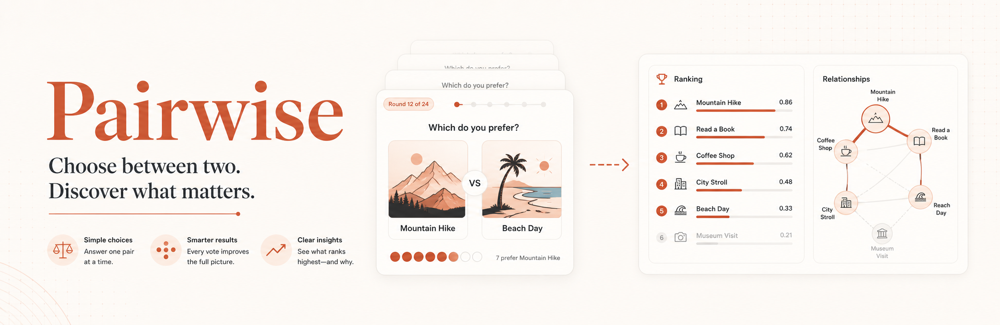

# ⚖️ Pairwise

A simple, modern, **self-hostable** pairwise voting tool — inspired by
[All Our Ideas](https://github.com/allourideas), rebuilt to run as a single
tiny **Bun** container with an embedded **SQLite** database.

Show people two ideas at a time and ask *"which do you prefer?"* — the app turns
the many small choices into one ranked list, and lets participants add their own
ideas along the way.

- **Zero external services.** One process, one SQLite file. No Postgres, no Redis.
- **Faithful algorithm.** Same Bayesian score and "catchup" pair-selection as the original (see below).
- **Multimodal.** Compare **text**, **images**, **audio**, or **video** — pick the mode per survey. Images are auto-converted to WebP and downscaled with Bun's built-in image API; video is YouTube embeds or uploaded WebM.
- **Multilingual.** Full i18n — ships with Danish and English, switchable in the header. Adding a language is one object in `src/i18n.ts`.
- **Looks good out of the box.** Responsive, light/dark theme, keyboard voting.
- **Link-based, no login.** Create a survey → get a public vote link, a results link, and a secret admin link.

---

## Quick start

### With Docker (recommended)

```bash
docker compose up --build
# open http://localhost:3000
```

The SQLite database is persisted in the `pairwise-data` volume.

Plain Docker:

```bash
docker build -t pairwise .
docker run -p 3000:3000 -v pairwise-data:/app/data pairwise
```

### Local dev (Bun)

```bash
bun install
bun run dev      # http://localhost:3000, hot reload
```

---

## How to use it

1. Open the home page and **create a survey**: a title, optional description, and
   at least two starting ideas (one per line).
2. You get three links:
   - **Vote link** `…/s/<slug>` — share this with participants.
   - **Results link** `…/s/<slug>/results` — public ranking.
   - **Admin link** `…/a/<token>` — **keep secret.** Approve submitted ideas,
     add/hide/delete ideas, edit settings, see stats.
3. Participants vote (mouse, or `←` / `→` keys, `S` to skip) and can submit their
   own ideas, which land in the admin moderation queue (unless auto-publish is on).

---

## Comparison modes

Each survey has one **mode**, chosen at creation:

| Mode | What participants compare | How items are added |
| --- | --- | --- |
| **Text** | Short text ideas | Type them (one per line) |
| **Image** | Photos / pictures | Upload — auto-converted to WebP, downscaled to ≤1280px via `Bun.Image` |
| **Audio** | Audio clips | Upload (mp3, wav, ogg, m4a … stored as-is) |
| **Video** | Videos | Paste YouTube links and/or upload WebM files |

You can add media both **on the create page** and later **in admin**. Participants
can also submit their own items (image/audio upload, or a YouTube link), subject
to the same moderation queue. Media files live on disk under `MEDIA_PATH` (inside
the data volume), so they persist with the database.

## Languages

The whole UI is internationalised. Ships with **Danish** and **English** — use the
switcher in the header (the choice is remembered in a cookie; first visit honours
the browser's `Accept-Language`). To add a language, add one catalog object plus a
`LOCALES` entry in [`src/i18n.ts`](src/i18n.ts) — nothing else changes. Survey
content (titles, ideas) is shown as authored and never machine-translated.

---

## The algorithm

Two ideas are taken faithfully from All Our Ideas' `pairwise-api`:

**1. Score (0–100)** — the posterior mean of a `Beta(1,1)` win-rate:

```
score = (wins + 1) / (wins + losses + 2) × 100
```

A brand-new idea sits at a neutral **50** and only moves once it accumulates
votes — so low-data ideas don't shoot to the top or bottom by luck. The score
approximates *"the chance this idea beats a randomly chosen other idea."*

**2. "Catchup" pair selection** — for every possible pair, the weight is:

```
weight(pair) = min( 1 / (pair_votes + 1) , 0.05 )
```

and the next pair is drawn at random in proportion to weight. Every pair with
few votes is explored roughly equally (so freshly-added ideas immediately enter
the rotation), while already-settled pairs are progressively starved. This is
the "greedy"/adaptive behaviour that makes the rankings converge efficiently.

**3. Anti-double-vote** — each impression gets a one-time `appearance` token; a
vote claims it with an atomic `UPDATE … WHERE answered IS NULL`, so the same
impression can never be counted twice.

### Differences from the original

| All Our Ideas (`pairwise-api`) | This project |
| --- | --- |
| Ruby on Rails + MySQL + Redis | Bun + Hono + `bun:sqlite` |
| 1000 pairs pre-generated into a Redis queue | weights computed per request from SQLite |
| MySQL deadlock-retry machinery | SQLite WAL + atomic conditional update |
| accounts, sites, multi-app API | link-based, no accounts |
| text ideas only | text · image · audio · video modes |
| single language | full i18n (Danish + English, extensible) |

Pair selection is `O(N²)` in the number of *active* ideas. That's comfortable
into the hundreds of ideas per survey — plenty for self-hosted use. Past a few
thousand ideas you'd want to reintroduce the batched/cached approach.

---

## Configuration

| Env var | Default | Description |
| --- | --- | --- |
| `PORT` | `3000` | HTTP port |
| `DATABASE_PATH` | `./data/pairwise.db` | SQLite file location |
| `MEDIA_PATH` | `<db dir>/media` | Where uploaded media (WebP, audio, WebM) is stored |

## Project layout

```
src/
  index.ts       Hono app + routes (pages + JSON API)
  db.ts          SQLite schema + data access (+ migrations)
  algorithm.ts   score() + choosePair() (catchup)
  media.ts       image→WebP (Bun.Image), audio/WebM, YouTube parsing
  i18n.ts        locale catalogs (da, en) + translator
  views.ts       server-rendered HTML
public/
  styles.css     theme + layout
  app.js         voting interaction (vanilla JS)
  fonts/         self-hosted Bricolage Grotesque + Geist (+ Mono)
Dockerfile, docker-compose.yml
```

## License

MIT.
